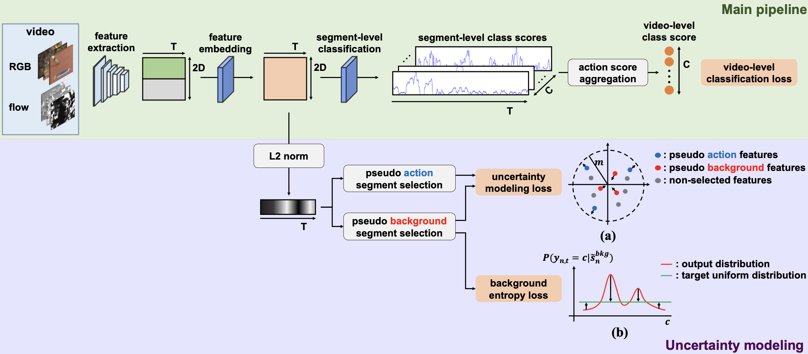
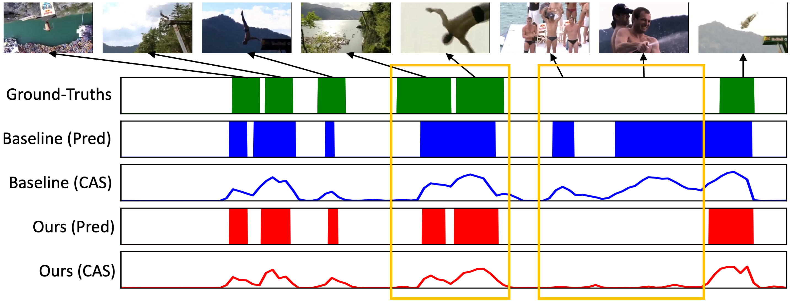

# RSC

A PyTorch implementation of RSC based on the paper
[Weakly-supervised Temporal Action Localization with Regional Similarity Consistency]().



## Usage

Git clone the corresponding repos and replace the files provided by us, then run the code according to `readme` of 
corresponding repos.

For example, to train HAM-Net on THUMOS14 dataset:
```
git clone https://github.com/asrafulashiq/hamnet.git
mv AGCT/hamnet/* hamnet/
python main.py
```

To evaluate HAM-Net on THUMOS14 dataset:
```
python main.py --test --ckpt [checkpoint_path]
```

## Benchmarks

The models are trained on one NVIDIA GeForce GTX 1080 Ti (11G). All the hyper-parameters are the default values.

### THUMOS14

<table>
<thead>
  <tr>
    <th rowspan="3">Method</th>
    <th colspan="8">THUMOS14</th>
    <th rowspan="3">Download</th>
  </tr>
  <tr>
    <td align="center">mAP@0.1</td>
    <td align="center">mAP@0.2</td>
    <td align="center">mAP@0.3</td>
    <td align="center">mAP@0.4</td>
    <td align="center">mAP@0.5</td>
    <td align="center">mAP@0.6</td>
    <td align="center">mAP@0.7</td>
    <td align="center">mAP@AVG</td>
  </tr>
</thead>
<tbody>
  <tr>
    <td align="center"><a href="https://github.com/asrafulashiq/hamnet">HAM-Net</a></td>
    <td align="center">66.9</td>
    <td align="center">60.2</td>
    <td align="center">51.0</td>
    <td align="center">42.0</td>
    <td align="center">31.7</td>
    <td align="center">22.1</td>
    <td align="center">12.0</td>
    <td align="center">40.9</td>
    <td align="center"><a href="https://1drv.ms/u/s!AtyHkt-GdJtIiwSrpPF3F94wOr4F?e=2bSjyz">OneDrive</a></td>
  </tr>
  <tr>
    <td align="center"><a href="https://github.com/zhang-can/CoLA">CoLA</a></td>
    <td align="center">67.2</td>
    <td align="center">61.5</td>
    <td align="center">52.9</td>
    <td align="center">43.9</td>
    <td align="center">34.8</td>
    <td align="center">24.9</td>
    <td align="center">13.0</td>
    <td align="center">42.6</td>
    <td align="center"><a href="https://1drv.ms/u/s!AtyHkt-GdJtIiwXQS-tauh7E-0yv?e=ukztyT">OneDrive</a></td>
  </tr>
  <tr>
    <td align="center"><a href="https://github.com/harlanhong/MM2021-CO2-Net">CO<sub>2</sub>-Net</a></td>
    <td align="center">70.6</td>
    <td align="center">64.2</td>
    <td align="center">55.9</td>
    <td align="center">47.7</td>
    <td align="center">38.9</td>
    <td align="center">26.0</td>
    <td align="center">13.6</td>
    <td align="center">45.3</td>
    <td align="center"><a href="https://1drv.ms/u/s!AtyHkt-GdJtIiwNl9__LaTp-qn9f?e=l4uAGe">OneDrive</a></td>
  </tr>
</tbody>
</table>

mAP@AVG is the average mAP under the thresholds 0.1:0.1:0.7.

## Results


